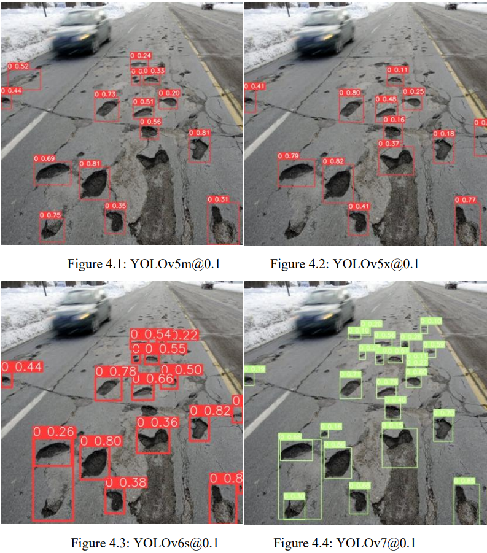
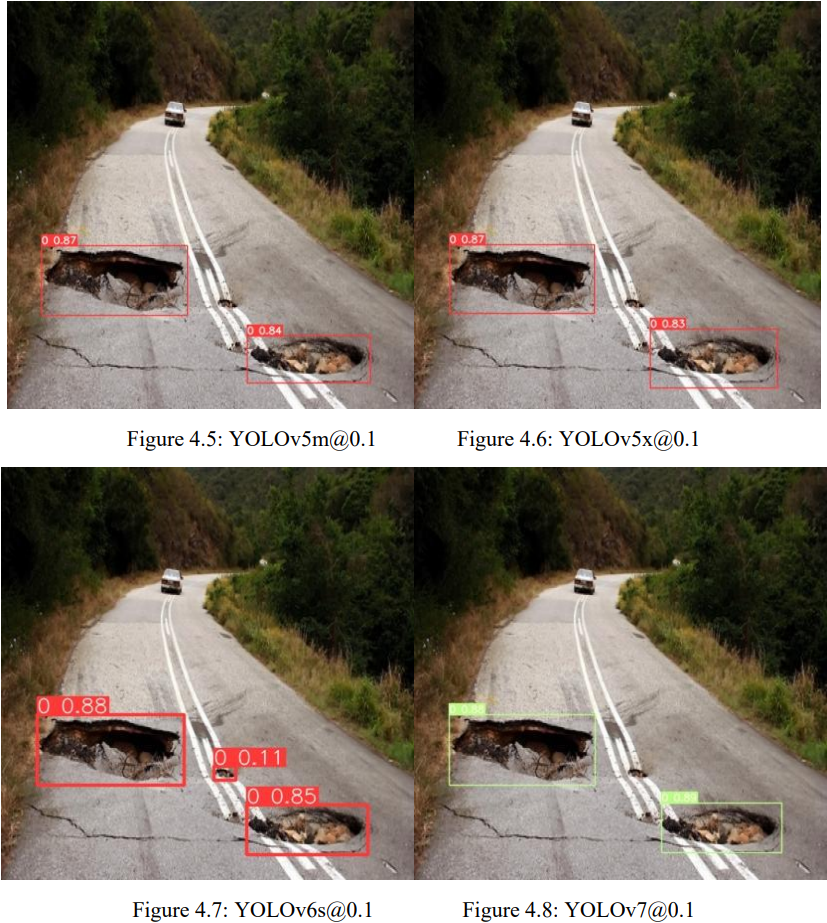
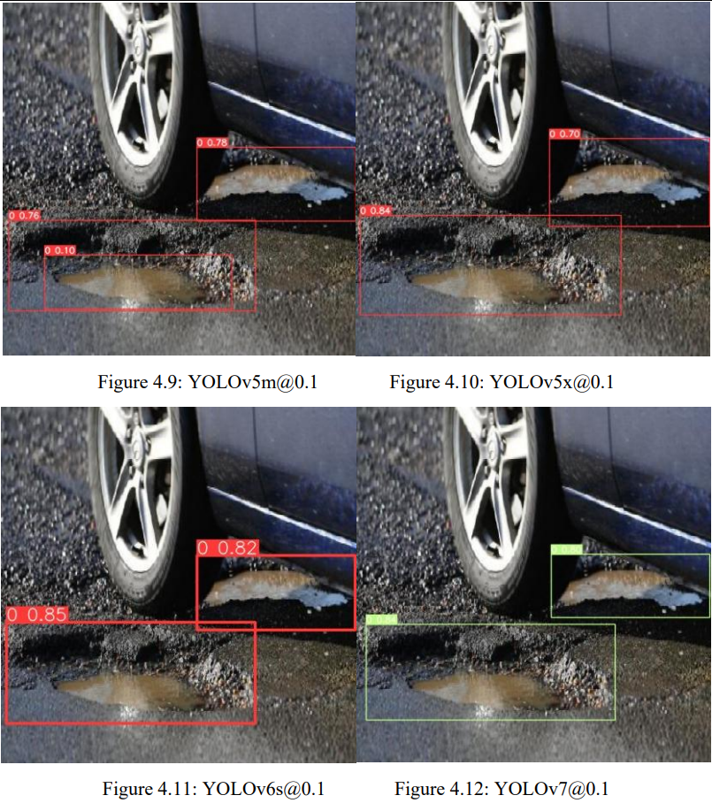
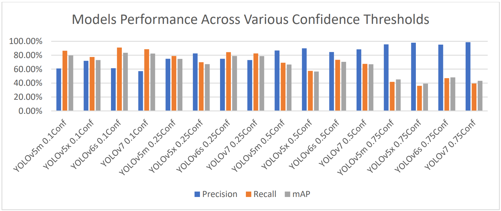
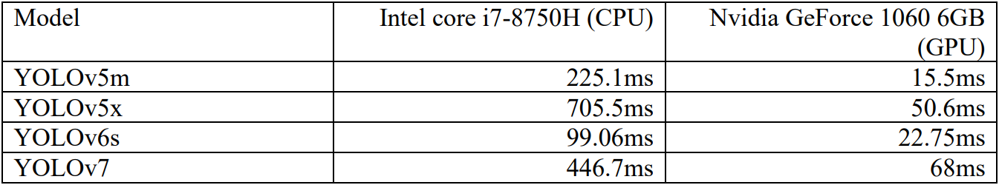

YOLOv5, YOLOv6 and YOLOv7 are finetuned to detect potholes. 

Img 1: Comparison between YOLOv5m, YOLOv5x, YOLOv6s and YOLOv7

 
Img 2: Comparison between YOLOv5m, YOLOv5x, YOLOv6s and YOLOv7

 
Img 3: Comparison between YOLOv5m, YOLOv5x, YOLOv6s and YOLOv7

 
Img 4: Precision, Recall and mAP at different confidence thresholds

 
Img 5: Inference time on Core i7-8750H and Nvidia GTX 1060 6GB

##Dataset
 
Dataset is build by combining two existing datasets from kaggle by [LARXEL](https://www.kaggle.com/datasets/andrewmvd/pothole-detection) and [SACHIN PATEL](https://www.kaggle.com/datasets/sachinpatel21/pothole-image-dataset).
Additional bounding boxes are drawn using [Roboflow](https://roboflow.com/).